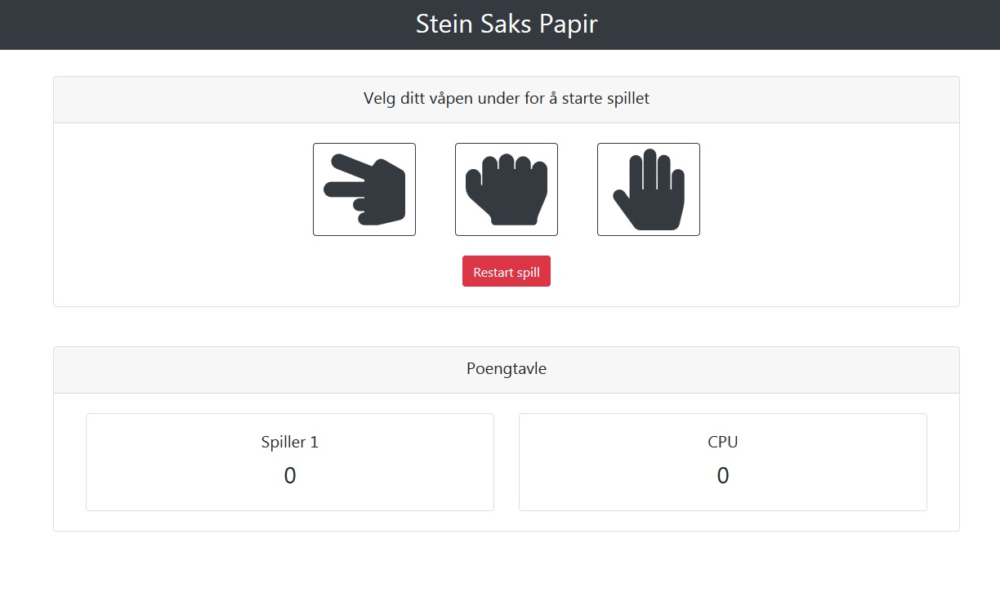

Live URL: <https://steinsakspapir.dfweb.no>

# Stein Saks Papir

Hjemmeoppgave gitt av Novacare.

Se gjerne [TODO](#todo) punktet lenger ned i README hvor jeg har listet opp en rekke idèer og tanker for refaktorering av kode og forbedringer.

## Prosjektbeskrivelse

Lag en interaktiv side der man kan spille stein-saks-papir (reglene finner du her: <http://agilekatas.co.uk/katas/RockPaperScissors-Kata>) og en tilleggsregel er at vinneren er den som er «best av 3».

## Teknologier / verktøy brukt

-   React 19 med hooks (useState og useEffect)

### UI / design

-   React Bootstrap
-   Animate.css for animasjoner
-   Responsivt design
-   Vektorbilder (SVG) fra FontAwesome
-   Aria-label på nødvendige elementer (WCAG standard)

### Testing / kodekvalitet

-   Cypress integrert med CircleCI for E2E testing
-   Testdekninganalyse via CodeCov
-   Vitest og React Testing Library
-   Scanning av koden via SonarCloud og DeepScan
-   TypeScript for typesikkerhet
-   ESLint med AirBnb for kodestandard
-   CircleCI som er integrert med CodeCov for opplasting av testdekningsrapport
-   JSDoc for kode-dokumentering

### State management

-   Zustand for å håndtere global state
-   useState med prop drilling (holde state så lokal som mulig)

## Hva jeg ville gjort annerledes i en profesjonell setting

-   Jeg ville brukt god tid på planleggingsfasen. Hatt et lengre møte hvor målet er å få utarbeidet en detaljert kravspesifikasjon, diskutere budsjett, tidsramme, valg av teknologier, langsiktige mål med siden. Det vil gjøre at man kan velge riktig teknologi for i dag og for fremtiden.
-   Jeg ville også satt opp `branch protection` på master og krevd minimum 1 code review fra en annen utvikler.
-   Enighet om felles Git commit message template innad for kunden.
-   Implementert React-Helmet for bedre kontroll over SEO
-   Prosjektet er nå migrert til TypeScript for bedre typesikkerhet og utvikleropplevelse.

### Resonnering og tanker

-   Jeg har valgt React ettersom jeg ikke så noe stort behov for å bruke Gatsby eller NextJS i dette prosjektet.
-   Jeg valgte React Bootstrap for UI ettersom det er et populært bibliotek som er enkelt å bruke.
-   Jeg har brukt ESLint og Airbnb for å opprettholde kodekvaliteten og gjøre utvikling enklere. Det fungerer også bra med integrert IDE støtte i VSCode. Det vil også gjøre videreutvikling og "maintainability" enklere på sikt. Jeg vurderte Typescript, men føler jeg må få mer erfaring med det først.
-   Jeg har brukt JSDoc for å dokumentere koden etter best mulig evne.
-   Jeg har brukt SVG bilder fra FontAwesome for å sørge for at bildene ser bra ut uavhengig av oppløsning.
-   Jeg har satt opp testing foreløpig med Jest, React-testing-library. Har også satt opp testing med Cypress. Alt er koblet oppimot CircleCI.
-   Jeg bruker Zustand for global state management ettersom det er lettvektig, enkelt å bruke, og fullt kompatibelt med React 19.
-   Jeg har implementert animasjoner med Animate.css fordi det er lettvint å implementere og jeg har brukt det før.
-   Jeg har forsøkt å holde state "ren" ved å bare ha score, increaseScore og reset der.

### <a id="todo">TODO med fremtidige potensielle/mulige forbedringer for refaktorering</a>

-   Refaktorere kode med skalering i bakhodet. Dette kan enklest gjøre ved å lagre hardkodet data i state og loope over feks våpen/spillere med forEach eller map slik at vi kan legge til flere spillere/våpen enkelt i fremtiden. Altså, gjøre data som skal skaleres dynamisk fremfor statisk og lagre denne i state. Det gjør skalering og fremtidig oppdatering enklere ved å holde alt på ett sted.
-   Fullfør arbeid med å separare ut state og actions i mindre filer i `/state/model` og slå de sammen. Gjør skalering og struktur bedre.
-   Implementere tester for hver enkelt komponent (med React Testing Library) separat istedenfor sånn som vi har de nå?
-   Implementere beskrivelse av reglene. Bruk <https://react-bootstrap.github.io/components/accordion/>
-   Vurder om Suspense og dynamisk rendering av komponenter ved behov bør implementeres.
-   Erstatte Animate.css med GSAP eller React-spring? Tillater mer kompliserte animasjoner men krever mer koding.
-   Se om jeg kan redusere prop drilling i komponenter ved å lagre mer informasjon i global state. Fordel er at komponenter blir "renere" fordi de ikke er avhengig av props. Ulempe er at det går imot det å holde state så "lavt" som mulig.
-   Se om jeg kan separere mer kode i enda mindre komponenter for å gjøre koden ryddigere og enklere å vedlikeholde/oppdatere? (Allerede påbegynt).
